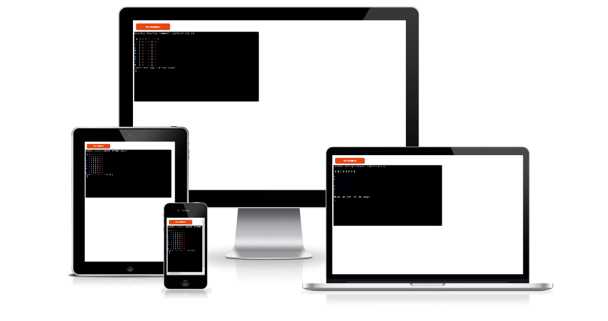
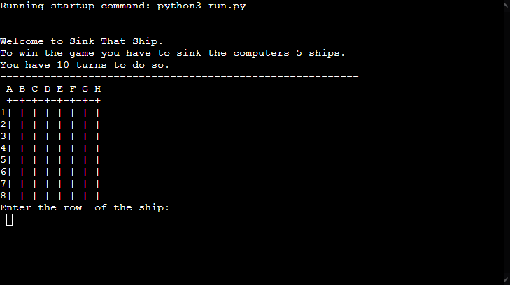
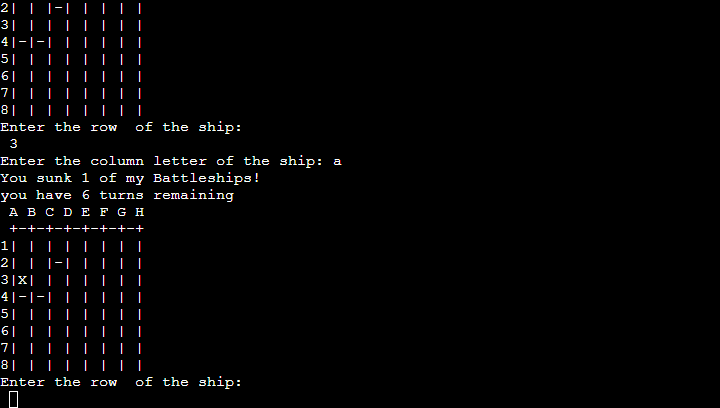
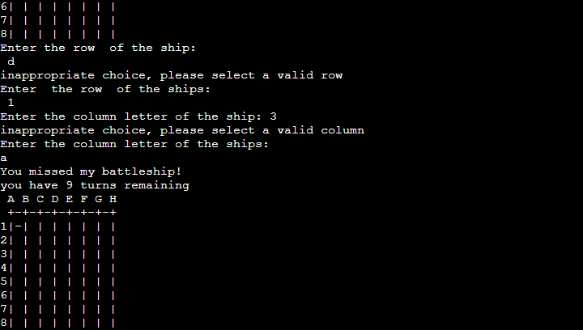
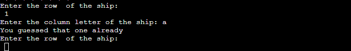
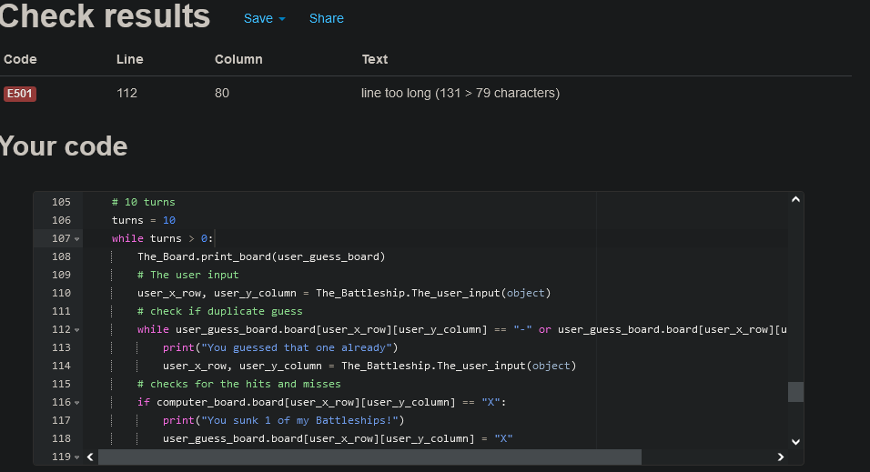

<h1 align="center">Sink That Ship</h1>

[view live project here.](https://sink-that-ship.herokuapp.com/)

<h2 align="center"></h2>

# User Experience (UX)

- ## User Stories

    - ### First Time Vistor Goals

        1. As a First Time Vistor, I want understand the main purpose of the website.

        2. As a First Time Vistor, I want be able to understand the rules of the game.

        3. As a First Time Vistor, I want to enjoy the game and be challanged by the games difficulty.

        4. As a First Time Vistor, I want all the informtion to be clearly visable on the screen.
    
    - ### Returning Vistor Goals

        1. As a Returning Vistor, I want to still find the game enjoyable and challanging.

# How to play

Sink That Ship is based on a classic pen and paper styled game.

The players opponent will be the computer who has randomly placed ships(5) to the board which you have to sink.

The players has 10 turns to sink all ships by before the game ends.

Players guesses are marked on the board as ```-```

Ships hit are marked on the board as ```X```

# Features

## Existing Features
- Random board generation

    - Ships are randomly placed on the board by the computer

    - The player cannot see where the ships are

    

    - Play against the computer to sink all 5 ships

    - You have 10 turns

    - Accepts user input

    - keeps tracks of turns left

    - keeps track of ships you have sunk

    - Marks places you have already hit

    

    - Input invalid error-checking

        -  You must enter a number from 1-8 for the row 

        - You must enter a letter from A-H for the column

        - You cannot enter the same guess twice

    
    

## Future Features

- Have a board for the player to posistion ships on to

- Have the computer try and hit the players ships on the board

- Add player and computers scores

# Data Model

I used two class's as my model, The_Board and The_Battleship.

The_Board class creates the board for the game and converts letters into numbers.

The_Battleship class creates the number of ships, the position of the ships and keeps track of how many ships have been hit. It also gets the player input data.

# Testing

I have manually tested this project by doing the following:

- Passed the code through a PEP8 linter and confirmed the are problems

- Given invalid inputs: strings when nubers are expected, numbers when strings expected, and same input twice

- Tested in my local terminal and the Code Institute Heroku terminal

## Bugs

### solved Bugs

- while writing the code I got many indentation errors which broke my code

- Had some value undefined errors that turned out spelling errors in my code

## Remaining Bugs

- No bugs remaining

## Validator Testing
- PEP8

    - 1 error: code on line 112 is too long (131 > 79 characters)

    - Tried to put some the code onto a new line to shorten it, but creates more errors breaking my code in the process.



# Deployment

This project was deployed using Code Institute's mock terminal for Heroku.

- Steps for deployment

    - Create a new Heroku app

    - set buildpack to ```Python``` and ```NodeJS``` in that order

    - link the Heroku app to the repository

    - click Deploy

# Credits

- credit goes to the youtuber Knowledge Mavens for the code structure [link to video here.](https://www.youtube.com/watch?v=alJH_c9t4zw)